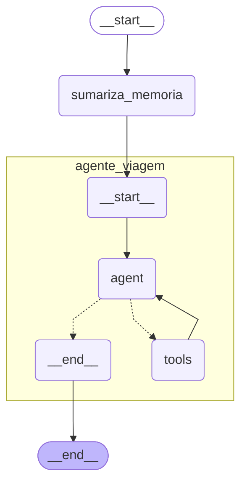

# 🤖 Agente de Viagens com Memórias

Agente autônomo inteligente para planejamento de viagens, construído com **LangGraph** e **OpenAI**, que utiliza memória de longo prazo em banco vetorial **Qdrant** para personalizar recomendações baseadas nas preferências e histórico do usuário.

## 🔴 Tutorial Youtube:
Acesso ao video no youtube onde eu ensino como implementar o projeto presente neste repositório:

- Seu Chatbot ESQUECE Tudo? Resolvi com Este Método (LangGraph + Memória - PARTE 1) - [Acessar link](https://youtu.be/dZ0jYf5wd4s)
- Criando o Chatbot com MEMÓRIA INFINITA do Zero (Python + LangGraph + Código Completo) -  [Acessar link](https://youtu.be/49Ncw6hzUHA)

## 📋 Sobre o Projeto

Este é um projeto educacional que demonstra como construir agentes de IA complexos com:

- **Memória persistente** usando bancos vetoriais (Qdrant)
- **Sumarização automática** de conversas longas
- **Planejamento de viagens** com busca na web e criação de itinerários
- **Personalização** baseada em preferências armazenadas do usuário
- **Arquitetura ReACT** (Reasoning and Acting) com LangGraph

## 🏗️ Arquitetura

O projeto utiliza **LangGraph** para criar um grafo de estados com os seguintes componentes:

```
START → Sumarização de Memória → Agente de Viagem → END
```
Estrutura do grafo (usar o https://www.mermaidchart.com/play):



### Componentes Principais

1. **Nó de Sumarização**: Comprime conversas quando ultrapassam 10 mensagens
2. **Agente de Viagem**: Agente ReACT com acesso a 5 ferramentas especializadas
3. **Memória Persistente**: Checkpointer SQLite + Qdrant para memórias de longo prazo

## 🛠️ Tecnologias Utilizadas

- **Python 3.13+**
- **LangGraph**: Framework para construção de agentes com estados
- **LangChain**: Ferramentas para integração com LLMs
- **OpenAI GPT-4o-mini**: Modelo de linguagem
- **Qdrant**: Banco vetorial para armazenamento de memórias
- **DuckDuckGo**: Busca na web
- **UV**: Gerenciador de pacotes e ambientes Python

## ⚙️ Funcionalidades

### 🧰 Ferramentas do Agente

1. **`search`** - Busca informações na web (DuckDuckGo)
2. **`buscar_conteudo_completo_site`** - Extrai conteúdo completo de URLs em markdown
3. **`retrieve_memories_tool`** - Recupera memórias do usuário por similaridade semântica
4. **`store_memory_tool`** - Armazena novas preferências e experiências do usuário
5. **`add_trips`** - Cria e salva itinerários de viagem estruturados

### 🧠 Tipos de Memória

- **Episodic**: Experiências pessoais e preferências específicas do usuário
  - Exemplo: "Usuário visitou Paris em 2023", "Usuário prefere hotéis boutique"

- **Semantic**: Conhecimento geral de domínio e fatos
  - Exemplo: "Londres tem ótimo transporte público", "Big Ben fica em Westminster"

## 📦 Instalação e Configuração

### Pré-requisitos

- Python 3.13 ou superior
- Docker (para Qdrant)
- Chaves de API da OpenAI

### 1. Instalar UV

```bash
# Windows (PowerShell)
powershell -c "irm https://astral.sh/uv/install.ps1 | iex"

# macOS/Linux
curl -LsSf https://astral.sh/uv/install.sh | sh
```

### 2. Clonar e Configurar o Projeto

```bash
# Clonar o repositório
git clone <seu-repositorio>
cd agente_com_memorias

# Sincronizar dependências (UV cria automaticamente o ambiente virtual)
uv sync
```

O comando `uv sync` irá:
- Criar um ambiente virtual isolado (.venv)
- Instalar todas as dependências do `pyproject.toml`
- Garantir que todas as versões sejam compatíveis com o lock file (`uv.lock`)

### 3. Configurar Variáveis de Ambiente

Crie um arquivo `.env` na raiz do projeto:

```env
OPENAI_API_KEY=sua-chave-openai-aqui
QDRANT_API_KEY=sua-chave-qdrant-aqui  # Opcional para Qdrant local
```

### 4. Iniciar o Qdrant (Docker)

```bash
docker run -p 6333:6333 -p 6334:6334 \
  -v $(pwd)/qdrant_storage:/qdrant/storage:z \
  qdrant/qdrant
```

Ou use o Qdrant Cloud: https://cloud.qdrant.io/

## 🚀 Como Usar

### Executar o Agente

```bash
# Ativar ambiente virtual do UV (se necessário)
source .venv/bin/activate  # Linux/macOS
.venv\Scripts\activate     # Windows

# Executar o workflow principal (novo ponto de entrada)
python main.py

# OU usando UV diretamente
uv run python main.py
```

### Exemplo de Interação

```python
from langchain_core.messages import HumanMessage
from src.agente_viagem.agents import TravelAgent
from src.agente_viagem.config import Settings
from src.agente_viagem.utils import print_stream_update

# Inicializa configurações
settings = Settings()
settings.validate()

# Cria o agente
with TravelAgent(settings) as agent:
    # Configuração da conversa
    configuracao = {
        "configurable": {
            "thread_id": "conversa_1",  # ID da thread (persiste conversa)
            "user_id": "Gustavo"         # ID do usuário (filtra memórias)
        }
    }
    
    # Enviar mensagem
    for chunk in agent.workflow.stream(
        {"messages": [HumanMessage(content="Quero viajar para Londres por 5 dias")]},
        config=configuracao,
        subgraphs=True,
        stream_mode="updates"
    ):
        print_stream_update(chunk)
```

### Fluxo de Uso Típico

1. **Primeira interação**: Agente não tem memórias, faz perguntas para conhecer preferências
2. **Coleta de informações**: Agente busca na web informações sobre destinos
3. **Armazenamento**: Preferências mencionadas são salvas automaticamente
4. **Criação de itinerário**: Quando solicitado, agente cria roteiro estruturado
5. **Interações futuras**: Agente recupera memórias para personalizar recomendações

## 📁 Estrutura do Projeto

O projeto foi reestruturado seguindo as melhores práticas de Python:

```
agente_viagem_com_memoria/
│
├── src/                          # Código fonte principal
│   └── agente_viagem/           # Pacote principal
│       ├── config/              # Configurações e constantes
│       ├── models/              # Modelos de dados (Place, Trip, Memory, State)
│       ├── services/            # Serviços (Database, MemoryService)
│       ├── tools/               # Ferramentas do agente
│       ├── agents/              # Agentes e workflows
│       └── utils/               # Utilitários (formatação, etc)
│
├── main.py                      # Ponto de entrada principal
├── pyproject.toml              # Configuração do projeto e dependências
├── uv.lock                     # Lock file de dependências
├── .env                        # Variáveis de ambiente (não versionado)
├── README.md                   # Este arquivo
└── ESTRUTURA.md                # Documentação detalhada da estrutura
```

Para mais detalhes sobre a organização do código, veja [ESTRUTURA.md](ESTRUTURA.md).

## 🧪 Testando Componentes Individuais

### Testar a Aplicação Completa

```bash
python main.py
```

### Testar Importações dos Módulos

```python
# Testar configurações
from src.agente_viagem.config import Settings, OPENAI_MODEL
settings = Settings()
settings.validate()

# Testar modelos
from src.agente_viagem.models import Place, Trip, Memory

# Testar serviços
from src.agente_viagem.services import DatabaseService, MemoryService

# Testar ferramentas
from src.agente_viagem.tools import search, buscar_conteudo_completo_site

# Buscar na web
results = search.invoke("pontos turísticos Londres")

# Extrair conteúdo de site
content = buscar_conteudo_completo_site.invoke("https://exemplo.com")
```

## 🔧 Gerenciamento de Dependências com UV

### Adicionar Nova Dependência

```bash
# Adicionar pacote
uv add nome-do-pacote

# Adicionar pacote de desenvolvimento
uv add --dev nome-do-pacote
```

### Atualizar Dependências

```bash
# Atualizar todas as dependências
uv sync --upgrade

# Atualizar pacote específico
uv add nome-do-pacote@latest
```

### Remover Dependência

```bash
uv remove nome-do-pacote
```

### Executar Scripts

```bash
# Executar script no ambiente UV
uv run python worflow.py
```

## 🎯 Principais Conceitos Demonstrados

### 1. **Arquitetura de Agentes com LangGraph**
- Grafos de estados para controle de fluxo
- Subgrafos para modularização
- Checkpointing para persistência

### 2. **Memória de Longo Prazo**
- Embeddings vetoriais (OpenAI text-embedding-3-small)
- Busca por similaridade semântica
- Categorização de memórias (episodic vs semantic)

### 3. **Sumarização de Contexto**
- Compressão automática de conversas longas
- Preservação de informações importantes
- Uso de `RemoveMessage` para limpeza de estado

### 4. **Prompt Engineering**
- Identity (Identidade)
- Tool Catalog (Catálogo de ferramentas)
- Decision Logic (Lógica de decisão)
- Error Handling (Tratamento de erros)
- Output Format (Formato de saída)
- Restrictions (Restrições)

### 5. **ReACT Pattern**
- Reasoning (raciocínio sobre qual ferramenta usar)
- Acting (execução de ferramentas)
- Iteração até conclusão da tarefa

## 📝 Licença

Este é um projeto educacional de código aberto. Sinta-se livre para usar, modificar e aprender com ele!

---

## 🔄 Melhorias Recentes

### Reestruturação com Melhores Práticas (v0.1.0)

O projeto foi completamente reestruturado seguindo as melhores práticas de desenvolvimento Python:

#### ✨ Principais Melhorias:

1. **Estrutura de Pacotes Profissional**
   - Código organizado em módulos com responsabilidades claras
   - Separação entre config, models, services, tools, agents e utils
   - Uso adequado de `__init__.py` para criar pacotes Python

2. **Gerenciamento de Configurações**
   - Classe `Settings` centraliza todas as configurações
   - Constantes extraídas para arquivo dedicado
   - Validação de configurações obrigatórias

3. **Separação de Responsabilidades**
   - `DatabaseService`: Gerencia persistência SQLite
   - `MemoryService`: Gerencia memórias no Qdrant
   - `TravelAgent`: Orquestra o workflow principal

4. **Injeção de Dependências**
   - Classes recebem dependências via construtor
   - Facilita testes e manutenção
   - Maior flexibilidade e reutilização

5. **Context Managers**
   - Gerenciamento automático de recursos (conexões, etc)
   - Código mais limpo e seguro

6. **Documentação Aprimorada**
   - Docstrings detalhadas em todas as classes e métodos
   - `ESTRUTURA.md` documenta a organização do código
   - Type hints para melhor IDE support

7. **Ponto de Entrada Claro**
   - `main.py` como entrada principal da aplicação
   - Fácil execução e customização

Para mais detalhes, consulte [ESTRUTURA.md](ESTRUTURA.md).

### Arquivos Legados

Os arquivos antigos na raiz (`worflow.py`, `state.py`, `tools.py`, etc.) foram mantidos para referência, mas o código novo está em `src/agente_viagem/`. Eles podem ser removidos após validação completa.